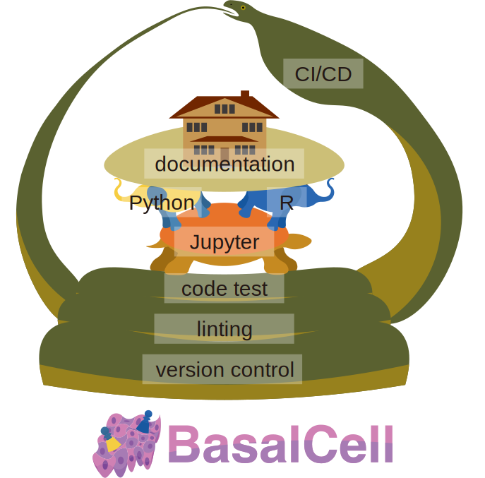

<div align="center">

</div>

# BasalCellDemo
[]()
[]()
[](https://basalcelldemo.readthedocs.io/en/latest/?badge=latest)
[](https://basalcelldemo.readthedocs.io/en/latest/)
[](https://basalcelldemo.readthedocs.io/en/latest/notebooks.html)
[](https://github.com/yo-aka-gene/BasalCellDemo)
<div align="center">

</div>
A demonstration of the BasalCell ecosystem through a simple scRNA-seq data analysis.


## Project Summary
1. scRNA-seq data preprocessing and automated annotation with Python packages
2. Manual annotation based on DEGs and GO terms and multi-label visualization with R packages

## Copyright of Data
- the PBMC 3k dataset: this dataset was provided by [10x Genomics](https://www.10xgenomics.com/datasets/3-k-pbm-cs-from-a-healthy-donor-1-standard-1-1-0)

### Data Installation
- the PBMC 3k dataset: download via `01_preprocessing_with_python.ipynb`

## Project Directory Tree
```bash
basalcelldemo/
    ├── .basalcell/                             # system directory
    ├── .github/
    │   ├── workflows/
    │   │   └── test.yml                        # write CI/CD configuration here
    │   └── pull_request_template.md
    ├── basalcelldemo_rtools/
    │   ├── R/                                  # write your R scripts here
    │   ├── tests/
    │   │   ├── testthat/                       # write your R test code here
    │   │   └── testthat.R
    │   └── vignettes/                          # write your R vignettes here (not actively recommended)
    │   │   └── example.Rmd
    │   ├── _pkgdown.yml                        # write R documentation configuration here
    │   └── DESCRIPTION                         # write R API info (semi-auto generated)
    ├── basalcelldemo_tools/
    │   └── __init__.py                         # init file for your Python utility scripts for analysis
    ├── data/                                   # store your data here
    ├── docs/                                   # documentation
    │   ├── _static/                            # directory for image files etc.
    │   │   └── default_logo.png                # place holder image for docs
    │   ├── jupyternb/                          # write .ipynb files here
    │   │   ├── output                          # export analysis results here
    │   │   ├── data                            # symbolic link to ../../data
    │   │   └── tools                           # symbolic link to ../../tools
    │   ├── conf.py                             # documentation configuration
    │   └── index.md                            # draft for index page
    ├── renv/                                   # R env configuration
    ├── test/                                   # write your Python test code here
    ├── .gitignore
    ├── .pre-commit-config.yaml                 # configuration for linting and tests
    ├── .readthedocs-config.yaml                # configuration for documentaion
    ├── environment.yml                         # detailed OS env configuration
    ├── Makefile                                # shortcut commands
    ├── poetry.lock                             # detailed Python env configuration
    ├── pyproject.toml                          # declarative Python env configuration
    ├── renv.lock                               # detailed R env configuration
    └── README.md                               # this file
```

## Author(s)
- Yuji Okano <[yujiokano@keio.jp](mailto:yujiokano@keio.jp)>
    - GitHub account: [yo-aka-gene](https://github.com/yo-aka-gene)


## Guidance for Collaborators and Researchers trying to reproduce the results
### :warning: Prerequisites
- This repository was created based on the [`BasalCell`](https://github.com/yo-aka-gene/BasalCell) template (version 0.4.1); please follow the `README.md` documentation for the prerequisite setup
- **For Windows Users**: Please make sure to access this directory via `WSL`


### Setting the Virtual Env
1. Fork this repository and clone it to your local environment.
>**Note**: If you are new to this repository or any other [BasalCell](https://github.com/yo-aka-gene/BasalCell)-based projects, run:
>```bash
>make setup-mamba
>```
2.  Run the initialization command:
```bash
make init
```
(This command will automatically install Python dependencies, register the Jupyter kernel, and build the R virtual environment).

### Launching Jupyter Lab
Run:
```bash
make launch
```
Then `Jupyter Lab` will pop up in your default browser.
**Note**: Sometimes, token is required to login to Jupyter Lab for the first time.
The default token is `basalcelldemo`.

### Adding Packages
This project uses a unified interface to add dependencies:
- **Python**: `make add-py PKG=name` (or `add-pydev` for dev tools)
    - install dependencies listed in `poetry.lock` with `make install-py`
- **R**: `make add-r PKG=name`
- **OS**: `make add-os PKG=name` (for Mamba/system libraries)

### Building Documentation
- For a brief guide on how to write documentation across various file types, please refer to the README.md of the [`BasalCell`](https://github.com/yo-aka-gene/BasalCell) repository.
- When creating R-related documentation, make sure to run `make docs` locally and commit the generated HTML files to the GitHub repository.


### Update Version Tags
```bash
make bump-patch  # 0.1.0 -> 0.1.1
make bump-minor  # 0.1.1 -> 0.2.0
make bump-major  # 0.2.0 -> 1.0.0
```

### Further Guidance for Repository Management
- Refer to the [`BasalCell`](https://github.com/yo-aka-gene/BasalCell) repository for detailed descriptions
- Refer to the [`BasalCellDemo`](https://github.com/yo-aka-gene/BasalCellDemo) repository for a real-world example of scRNA-seq data analysis using Python and R
---
This project was created with [Cookiecutter](https://github.com/cookiecutter/cookiecutter) and [BasalCell](https://github.com/yo-aka-gene/BasalCell) version 0.4.1
